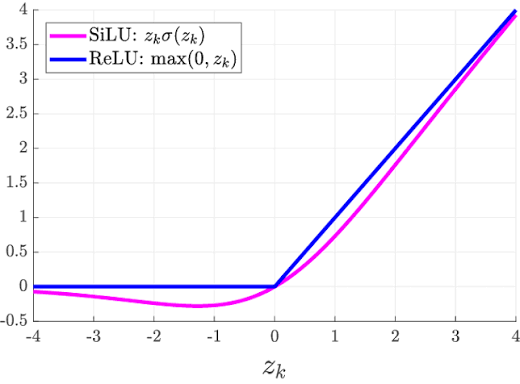

之前我完成了对以 _Attention is All You Need_ 为蓝本的 decoder-only Transformer 的理解。接下来了解一个当代真实的 LLM 架构，来加深对 LLM 的理解。

## Overview

Qwen3-4b-Instruct 的核心超参

| 项目         | 值                                                           |
| ------------ | ------------------------------------------------------------ |
| 层数         | 36                                                           |
| hidden\_size | 2560                                                         |
| 注意力       | GQA：32 个 Q 头 / 8 个 KV 头，head\_dim 128                  |
| MLP          | SwiGLU，intermediate 9728                                    |
| 归一化       | RMSNorm（pre-norm）+ QK-Norm                                 |
| 位置编码     | RoPE，`rope_theta=5,000,000`，native context **262,144 tokens** |

架构为

- Embedding 151936 by 2560
- 36 layers of
  - RMSNorm + GQA Attention + Residual
  - RMSNorm + SwiGLU MLP + Residual
- RMSNorm
- LM Head = Transpose of Embedding

## RMSNorm

先来看看原来用的 LayerNorm
$$
\text{LayerNorm}(x) = \gamma \odot \frac{x - \mu}{\sqrt{\sigma^2 + \epsilon}} + \beta
$$
（其实 $\gamma$ 是个向量）$\gamma,\beta$ 是可选参数。
$$
\operatorname{RMSNorm}(x)=\gamma\odot\frac{x}{\sqrt{\frac 1d\sum x_i^2+\epsilon}}
$$

```python
torch.nn.RMSNorm(normalized_shape, eps=None, elementwise_affine=True, device=None, dtype=None)
```

这里 `eps` 的作用是防止除以零，`elementwise_affine` 决定是否训练 $\gamma$

## Gated MLP (SwiGLU)

原来 FFN 的 $\operatorname{ReLU}(xW_1)W_2$ 被改成了
$$
\text{FFN}(x)=(\text{SiLU}(xW_{\text{gate}})\odot (xW_{\text{up}}))W_{\text{down}}
$$
其中
$$
\operatorname{SiLU}(x)=x\cdot\operatorname{sigmoid}(x)=\frac{x}{1+e^{-x}}
$$


```python
class TransformerBlock(nn.Module):
    def __init__(self, d_model: int = 12, n_heads: int = 3, d_ff: int = 48) -> None:
        super().__init__()
        if d_ff < 1:
            raise ValueError("d_ff must be positive.")
        self.attention = MultiHeadSelfAttention(d_model, n_heads)
        self.norm1 = nn.RMSNorm(d_model, eps=1e-6)
        self.norm2 = nn.RMSNorm(d_model, eps=1e-6)
        self.gate = nn.Linear(d_model, d_ff, bias=False)
        self.up = nn.Linear(d_model, d_ff, bias=False)
        self.down = nn.Linear(d_ff, d_model, bias=False)

    def feed_forward(self, x: Tensor) -> Tensor:
        z1 = F.silu(self.gate(x)) * self.up(x) # from torch.nn import functional as F
        z2 = self.down(z1)
        return z2
```

## GQA Attention

32 个 Q 头共享 8 组 KV（每 4 个 Q 头用同一组 KV），用于减少 KV 缓存，没什么好说的。

```python
q = self.q_norm(self.split_heads(self.wq(x), self.n_heads)) # QK-Norm
k = self.k_norm(self.split_heads(self.wk(x), self.n_kv_heads))
v = self.split_heads(self.wv(x), self.n_kv_heads)

repeats = self.n_heads // self.n_kv_heads
k = k.repeat_interleave(repeats, dim=1)
v = v.repeat_interleave(repeats, dim=1)
attended = scaled_dot_product_attention(q, k, v, causal=causal)
return self.wo(self.merge_heads(attended))
```

## RoPE

用于解决只在 token embedding 上加 position embedding 导致在深层网络信息丢失的问题。

我们知道二维向量内积的大小和它们的夹角相关。将两个向量各转一个角度（乘以旋转变换矩阵），它们的内积就会反映它们的相对旋转角度。利用这个原理我们就能将位置编码进**每个**注意力层的 QK。

对于 Q 和 K（Qwen3-4b 有 `head_dim=128`），把向量的元素两两一组分成 $d/2=64$ 个二维平面，第 $j$ 个平面的角速度为 $\theta=\text{base}^{-2j/d}$。Qwen3-4b 取 `base=5,000,000`，有

| 平面             | 角速度（rad/token） | 转一圈所需 token 数 |
| ---------------- | ------------------- | ------------------- |
| 第 0 组（低维）  | 1.0                 | ≈ 6                 |
| 第 32 组         | $4.5\times10^{-4}$  | ≈ 14,050            |
| 第 63 组（高维） | $2.6\times10^{-7}$  | ≈ 2,470 万          |

（一点物理知识的回顾：在别的地方可能会看到频率的说法，其实和角速度是成正比的 $\omega=2\pi f$）

低维对相对位置更敏感，可以观察局部位置；高维则可以观察长程位置。

在 Qwen3-4b 中，这个操作在 QK-Norm 之后，K 被写入缓存和 softmax 注意力之前。

## 其他小改动

- tied embedding，lm-head 直接就是 embedding 矩阵的转置。这样 lm-head 算的其实是输入向量与 embedding 中的向量的相似度（内积），与 logits 分数语义相符。
- **pre-normalization**

不同于 post-normalization，我们这里先 norm 再过注意力或者 Feed Forward Network

```python
z1 = x + self.attention(self.norm1(x), causal=causal)
z2 = z1 + self.feed_forward(self.norm2(z1))
```

- QK-Norm（在 Q、K 做完线性投影、进 RoPE **之前**，对每头的向量做一次 RMSNorm）

## Afterword

我们来计算一下参数量。这个模型 4b 的参数到底是怎么堆出来的？

- Embedding 151936 × 2560 = 389.0M
-  **每层 Attention：26.21M × 36 层 = 944M**

| 矩阵    | 形状                 | 参数量 |
| ------- | -------------------- | ------ |
| q\_proj | 2560 × (32×128=4096) | 10.49M |
| k\_proj | 2560 × (8×128=1024)  | 2.62M  |
| v\_proj | 2560 × 1024          | 2.62M  |
| o\_proj | 4096 × 2560          | 10.49M |

- **每层 FFN：74.71M × 36 层 = 2.690B**（gate/up/down 三个矩阵，每个 2560 × 9728）

| 组件              | 参数量 | 占比  |
| ----------------- | ------ | ----- |
| Embedding（tied） | 0.389B | 9.7%  |
| Attention ×36     | 0.944B | 23.5% |
| FFN ×36           | 2.690B | 66.9% |

RMSNorm 每层只有 2×2560 参数，忽略不计。

**观察：FFN 层占参数的大头，Attention 只占总参数的 1/4。如果是 MoE 模型，FFN 还会更大，这时 Attention（总是激活）占总参数的比例会更小。**

KV cache 究竟占了多少显存？

- 2 (K+V) × 36 层 × 8 KV头 × 128 head_dim × 2 字节 = **144 KiB / token**

| 上下文      | KV cache | 占权重比例 |
| ----------- | -------- | ---------- |
| 4K tokens   | 0.56 GiB | 7.5%       |
| 8K tokens   | 1.12 GiB | 15%        |
| 32K tokens  | 4.5 GiB  | 60%        |
| 128K tokens | 18 GiB   | 240%       |

可以看到，由于 KV cache 是随 context 的增加线性增长的，很容易超过模型权重。
