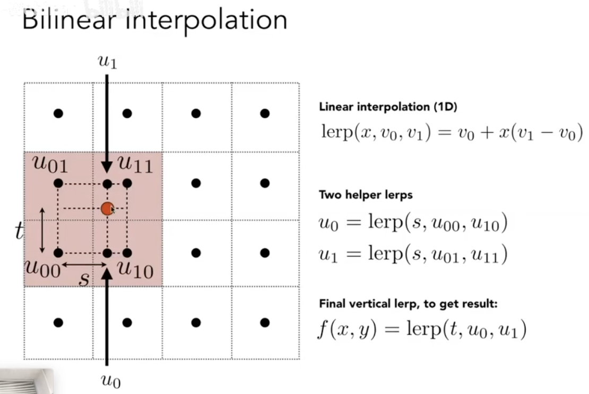

除特殊标明外，代码全部来自 GAMES101 Assignment 3

# Rasterization

Code tells (almost) everything.

```cpp
//Screen space rasterization
void rst::rasterizer::rasterize_triangle(const Triangle& t, const std::array<Eigen::Vector3f, 3>& view_pos) 
{
    auto v = t.toVector4();
    
    auto [l, r] = std::minmax({t.v[0].x(), t.v[1].x(), t.v[2].x()});
    auto [b, o] = std::minmax({t.v[0].y(), t.v[1].y(), t.v[2].y()});

    // iterate through the pixel and find how much space of a current pixel is inside the triangle
    for (int x = l; x <= ceil(r); x++) {
        for (int y = b; y <= ceil(o); y++) {
            auto[alpha, beta, gamma] = computeBarycentric2D(x, y, t.v);

            //    * v[i].w() is the vertex view space depth value z.
            //    * Z is interpolated view space depth for the current pixel
            //    * zp is depth between zNear and zFar, used for z-buffer

            float Z = 1.0 / (alpha / v[0].w() + beta / v[1].w() + gamma / v[2].w());
            float zp = alpha * v[0].z() / v[0].w() + beta * v[1].z() / v[1].w() + gamma * v[2].z() / v[2].w();
            zp *= Z;

            int ind = get_index(x, y);

            if (insideTriangle(x, y, t.v) && zp < depth_buf[ind]) {
                auto interpolated_color = alpha * t.color[0] + beta * t.color[1] + gamma * t.color[2];
                auto interpolated_normal = alpha * t.normal[0] + beta * t.normal[1] + gamma * t.normal[2];
                auto interpolated_texcoords = alpha * t.tex_coords[0] + beta * t.tex_coords[1] + gamma * t.tex_coords[2];
                auto interpolated_shadingcoords = alpha * view_pos[0] + beta * view_pos[1] + gamma * view_pos[2];

                fragment_shader_payload payload( interpolated_color, interpolated_normal.normalized(), interpolated_texcoords, texture ? &*texture : nullptr);
                // Use: Instead of passing the triangle's color directly to the frame buffer, pass the color to the shaders first to get the final color;
                payload.view_pos = interpolated_shadingcoords;
                auto pixel_color = fragment_shader(payload);
            
                depth_buf[ind] = zp;
                set_pixel(Eigen::Vector2i(x, y), pixel_color);
            }
        }
    }
}

```

注意 `interpolated_shadingcoords` 使用的坐标是真实空间坐标（变换到屏幕空间前的坐标）。在 Blinn-Phong 里需要计算真实空间中的光线方向、视线方向，所以需要投影前的观察空间坐标。

在 Assignment 2 中，还将每个像素内部做四次采样（超采样）的结果混合来做抗锯齿，具体的做法类似把一个像素假装成四个像素。此处忽略。

# Shading

## Blinn-Phong

The Blinn-Phong model combines diffuse, specular, and ambient terms.

The diffuse term is independent of the viewer direction:

$$
L_d=k_d\left(\frac{I}{r^2}\right)\max(0,\mathbf n\cdot\mathbf l)
$$

Here $k_d$ is the diffuse coefficient, $I$ is light intensity, $r$ is distance to the light, $\mathbf n$ is the surface normal, and $\mathbf l$ is the light direction.

The specular term depends on view direction. Blinn-Phong uses the half vector:

$$
\mathbf h=\frac{\mathbf v+\mathbf l}{\|\mathbf v+\mathbf l\|}
$$

Then:

$$
L_s=k_s\left(\frac{I}{r^2}\right)\max(0,\mathbf n\cdot\mathbf h)^p
$$

Here $k_s$ is the specular coefficient and $p$ controls shininess.

The ambient term is a constant approximation:

$$
L_a=k_aI_a
$$

It fills in otherwise-black regions but is not a physically accurate model of indirect light.

```cpp
Eigen::Vector3f phong_fragment_shader(const fragment_shader_payload& payload)
{
    Eigen::Vector3f ka = Eigen::Vector3f(0.005, 0.005, 0.005);
    Eigen::Vector3f kd = payload.color;
    Eigen::Vector3f ks = Eigen::Vector3f(0.7937, 0.7937, 0.7937);

    auto l1 = light{{20, 20, 20}, {500, 500, 500}};
    auto l2 = light{{-20, 20, 0}, {500, 500, 500}};

    std::vector<light> lights = {l1, l2};
    Eigen::Vector3f amb_light_intensity{10, 10, 10};
    Eigen::Vector3f eye_pos{0, 0, 10};

    float p = 150;

    Eigen::Vector3f color = payload.color;
    Eigen::Vector3f point = payload.view_pos;
    Eigen::Vector3f normal = payload.normal;

    Eigen::Vector3f result_color = {0, 0, 0};
    for (auto& light : lights)
    {
        // DONE: For each light source in the code, calculate what the *ambient*, *diffuse*, and *specular* 
        // components are. Then, accumulate that result on the *result_color* object.
        
        auto light_direction = (light.position - point).normalized();
        auto view_direction = (eye_pos - point).normalized();
        auto half_vector = (view_direction + light_direction).normalized();
        auto intensity = light.intensity / (light.position - point).squaredNorm();

        Eigen::Vector3f diffuse = kd.cwiseProduct(intensity) * std::max(0.f, normal.dot(light_direction));
        Eigen::Vector3f specular = ks.cwiseProduct(intensity) * pow(std::max(0.f, normal.dot(half_vector)), p);
        Eigen::Vector3f ambient = ka.cwiseProduct(amb_light_intensity);

        result_color += diffuse + specular + ambient;
    }

    return result_color * 255.f;
}

```

## Texture

```cpp
return_color = payload.texture->getColor(payload.tex_coords.x(), payload.tex_coords.y());
```

## Bump

听听 Kimi 怎么说：

**`// Let n = normal = (x, y, z)`**
> 输入的原始表面法线（通常来自顶点属性，已归一化）。

**`// Vector t = (x*y/sqrt(x*x+z*z), sqrt(x*x+z*z), z*y/sqrt(x*x+z*z))`**
> 从法线 `n` 推导 **Tangent（切线）向量** `t`。这是在没有显式切线数据时的近似算法——利用法线 `n` 在 xz 平面的投影来构造一个与 `n` 正交的向量。当 `n` 接近 `(0, ±1, 0)` 时这个公式会退化（分母趋近0），实际工程中通常会加保护分支。

**`// Vector b = n cross product t`**
> 用叉积求 **Bitangent（副切线）向量** `b`。`t`、`b`、`n` 两两正交，构成局部切线空间的三个基向量。

**`// Matrix TBN = [t b n]`**
> 将 `t`、`b`、`n` 作为列向量拼成 **TBN 矩阵**。它的作用是把「贴图空间（切线空间）」中的向量转换到「世界/模型空间」。

**`// dU = kh * kn * (h(u+1/w,v)-h(u,v))`**
> 计算高度图在 **U 方向** 的偏导数：
> - `h(u,v)`：在纹理坐标 `(u,v)` 处采样高度值
> - `1/w`：U 方向一个 texel 的步长（`w` 是纹理宽度）
> - `kh`：高度缩放系数（控制凹凸幅度）
> - `kn`：法线扰动强度系数

**`// dV = kh * kn * (h(u,v+1/h)-h(u,v))`**
> 同理，计算高度图在 **V 方向** 的偏导数（`h` 是纹理高度）。

**`// Vector ln = (-dU, -dV, 1)`**
> 构造 **切线空间下的扰动法线**。
>
> 原理：高度图 `h(u,v)` 描述了一个隐式曲面 `z = h(u,v)`，其法线方向与梯度 `(-∂h/∂u, -∂h/∂v, 1)` 成正比。这里 `dU` 和 `dV` 就是两个方向的梯度近似。

**`// Normal n = normalize(TBN * ln)`**
> 将切线空间的扰动法线 `ln` 通过 TBN 矩阵变换到模型/世界空间，然后归一化，得到最终用于光照计算的法线。

这段代码用**有限差分**从高度图求梯度，构造切线空间法线，再通过 TBN 矩阵转回世界空间——让平面「假装」有凹凸。

作业里是把颜色的 L2 范数当作「高度」，这部分没有用 Blinn-Phong，而是直接输出扰动后的法线贴图。

## Displacement

|                    | Bump Mapping（凹凸贴图）  | Displacement Mapping（位移贴图）                            |
| ------------------ | ------------------------- | ----------------------------------------------------------- |
| 改动什么           | 只扰动**法线**            | 先移动**位置**，再扰动法线                                  |
| 核心公式           | `n = normalize(TBN * ln)` | `p = p + kn·n·h(u,v)`，然后同样的 `n = normalize(TBN * ln)` |
| 几何本身           | 完全不动                  | 真的发生偏移                                                |
| 轮廓（silhouette） | 光滑如初——侧面看会露馅    | 边缘也跟着起伏                                              |
| 自遮挡/投影        | 不可能产生                | 真实渲染器中可以产生                                        |
| 成本               | 极低，逐像素算一次        | 真正做需要细分曲面/曲面细分着色器，贵                       |

**A3 这个作业里有个例外要知道**：两个 shader 都是 **fragment shader**，displacement 里的 `p = p + kn·n·h(u,v)` 移动的只是**用于着色计算的那个点**（影响光线方向 `light.position - point` 和视线方向 `eye_pos - point`），它**不会回写深度缓冲，也不会改变三角形的光栅化范围**。所以在这个软件光栅化器里，displacement 的「位移」只影响光照强弱，模型轮廓依然不变。

## Bilinear Interpolation

Texture coordinates $(u,v)$ map points on a surface to positions in texture space.

When a texture lookup lands between texel centers, bilinear interpolation blends the nearest four texels:



The result is smoother than nearest-neighbor sampling because the returned value changes continuously across texel boundaries.

Bicubic interpolation extends the same idea by using a $4\times4$ neighborhood instead of a $2\times2$ neighborhood.

