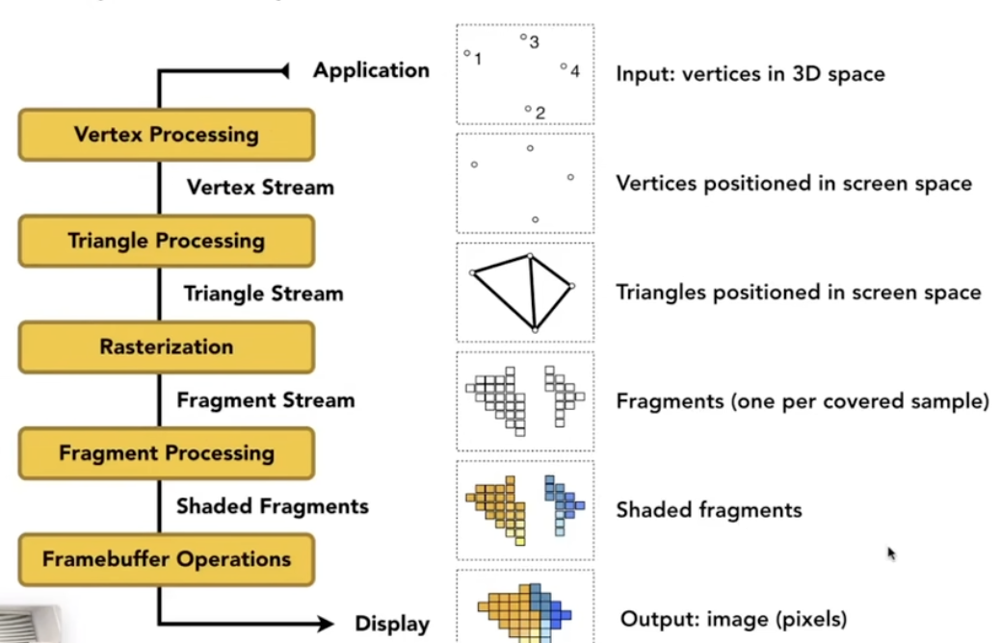

# Matrix Basics

不得不把矩阵乘法弄明白了。譬如二维旋转变换矩阵
$$
R_\theta=
\begin{bmatrix}
\cos\theta & -\sin\theta\\
\sin\theta & \cos\theta
\end{bmatrix}
$$
乘 $\begin{bmatrix}
 x\\
 y
 \end{bmatrix}$，结果为 $\begin{bmatrix}
 a\\
 b
 \end{bmatrix}$，那么：$a=x\cos\theta - y\sin\theta$。

也就是说：矩阵乘列向量时，结果的第 $i$ 维（行）来自于矩阵第 $i$ 行作为系数的贡献。换句话说，**结果向量的每个元素都是原来向量元素的线性组合，而变化的系数来自矩阵**。同样的，也可以说是直接以向量为系数，对矩阵的所有列向量线性组合的结果。

矩阵也可以看成是元素为行向量的列向量。也就是说，矩阵 $AB$ 的第 $i$ 行是 $A$ 的第 $i$ 行作为系数将$B$ 的行向量线性组合的结果。因此，$A$ 的行向量维数（即列数）等于 $B$ 的行数。

将 $A$ 视为一个函数，作用在一组向量上。$A$ 的每一行描述一个线性组合（的系数），得到的结果 $AB$ 的每一行对应 $A$ 在那一行上描述的线性组合。

同理，也可以认为 $A$ 是由列向量组成的行向量。既然这样，$AB$ 的每一列都是 $A$ 的列向量的线性组合，第 $i$ 列为系数为 $B$ 的第 $i$ 列。所以可以说 $(AB)^T=B^TA^T$。

这样也就不难证明行秩等于列秩了。对于行秩为 $r$ 的矩阵 $C$，其行向量可以被 $r$ 个行向量的线性组合表出。将这 $r$ 个行向量组合为 $B$，则 $C=AB$。这样 $C$ 的列向量也是 $r$ 个 $A$ 的列向量的线性组合。于是列秩大于等于 $r$。反之亦然。

所以矩阵乘法到底在干什么呢？简单来说，就是**以一个矩阵为系数，将另一个矩阵重新线性组合**的过程。不同的行意味着不同的系数，也就是不同的线性组合。

在计算机图形学里，目前最好的方法还是将矩阵看成是 $x'=ax+by+cz+d$ 的缩写（当齐次向量最后一维为 $1$ 时）。或者说，以行向量作为系数的视角看。

# Quick Review

## Basic Transformations

- 仿射（Affine）
  - Scale
    - Uniform: $sI$
    - Non-uniform: $\begin{bmatrix} s_x & 0\\ 0 & s_y \end{bmatrix}$
  - Reflection across the y-axis: $\begin{bmatrix}
     -1 & 0\\
     0 & 1
     \end{bmatrix}$
  - Horizontal shear: $\begin{bmatrix}
     1 & a\\
     0 & 1
     \end{bmatrix}$
  - Counterclockwise rotation around the origin: $R_\theta=
      \begin{bmatrix}
      \cos\theta & -\sin\theta\\
      \sin\theta & \cos\theta
      \end{bmatrix}$
  - 3D Rotation: $\mathbf R(\mathbf n,\alpha)
      =\cos\alpha\mathbf I
      +(1-\cos\alpha)\mathbf n\mathbf n^T
      +\sin\alpha
      \begin{bmatrix}
      0&-n_z&n_y\\
      n_z&0&-n_x\\
      -n_y&n_x&0
      \end{bmatrix}$, where $\mathbf n$ is a unit vector.
- 2D Homogeneous coordinates
  - point: $(x,y,1)^T$
  - vector: $(x,y,0)^T$
- 平移（Translation）
  - $\begin{bmatrix}
     1&0&t_x\\
     0&1&t_y\\
     0&0&1
     \end{bmatrix}$（若是 vector 与之相乘，结果不变）

## Transformation Pipeline for Rendering (MVP)

取自 GAMES101 Assignment 2 `main.cpp` 中的代码：

```cpp
r.clear(rst::Buffers::Color | rst::Buffers::Depth);

r.set_model(get_model_matrix(angle));
r.set_view(get_view_matrix(eye_pos));
r.set_projection(get_projection_matrix(45, 1, 0.1, 50));
```

| 代码                  | 阶段           | 作用                                                         |
| --------------------- | -------------- | ------------------------------------------------------------ |
| `set_model(...)`      | **M**odel      | 定义物体在**世界空间**中的位置、旋转、缩放。`angle` 通常是绕某轴的旋转角。 |
| `set_view(...)`       | **V**iew       | 定义**相机**的位置和朝向。`eye_pos` 是相机在世界中的坐标，矩阵会把世界变换到以相机为原点的观察空间。（如果相机本来的朝向和 canonical 朝向不一样，还要进行绕原点的旋转） |
| `set_projection(...)` | **P**rojection | 把观察空间映射到**裁剪空间/屏幕空间**。参数依次是：FOV(45°)、宽高比(1)、近裁剪面(0.1)、远裁剪面(50)。 |

```cpp
Eigen::Matrix4f get_projection_matrix(float eye_fov, float aspect_ratio,
                                      float zNear, float zFar)
{
    Eigen::Matrix4f projection = Eigen::Matrix4f::Identity();

    float eyev = eye_fov * MY_PI / 180;
    float n = zNear, f = zFar;
    float t = n * std::tan(eyev), b = -t, r = t * aspect_ratio, l = -r;

    Eigen::Matrix4f persp_to_ortho;
    persp_to_ortho <<
        -n, 0, 0, 0,
        0, -n, 0, 0,
        0, 0, -n-f, -n*f,
        0, 0, 1, 0;

    Eigen::Matrix4f ortho_translate, ortho_scale;
    ortho_translate <<
        1, 0, 0, -(l+r)/2,
        0, 1, 0, -(b+t)/2,
        0, 0, 1, (n+f)/2,
        0, 0, 0, 1;
    ortho_scale <<
        2/(r-l), 0, 0, 0,
        0, 2/(t-b), 0, 0,
        0, 0, 2/(n-f), 0,
        0, 0, 0, 1;

    Eigen::Matrix4f ortho = ortho_scale * ortho_translate;
    projection = ortho * persp_to_ortho * projection;

    return projection;
}

```

Projection 阶段，首先把视锥变成柱状（`persp_to_ortho`），然后将这个柱体放入 $[-1,1]^3$ 的视口（`ortho = ortho_scale * ortho_translate`）。

这里 `persp_to_ortho` 矩阵的推导来自近平面不变、远平面中心不变。

- 近平面不变：对于近平面上的点 $(x,y,n,1)^T$，经过变换的结果为 $(nx,ny,n^2,n)^T$
- 远平面中心不变：远平面中心 $(0,0,f,1)^T$ 的变换结果为 $(0, 0, f^2, f)^T$

所以矩阵为
$$
\mathbf M_{persp\to ortho}=
\begin{bmatrix}
n&0&0&0\\
0&n&0&0\\
0&0&n+f&-nf\\
0&0&1&0
\end{bmatrix}
$$
但是实际上作业中相机是朝着 $-z$ 看的，传递的参数 `zNear` 和 `zFar` 又是正数（代表距离而不是坐标），所以作业里的矩阵在 $n,f$ 前面加上了负号。并且为了保证深度正确（离相机远的点深度大），在 `ortho_scale` 一步加入了翻转操作，让 $z$ 变成了正数。

现在所有的点都被放入 $[-1,1]^3$ 的视口中了，接下来把变换后的顶点组装成三角形，就可以开始光栅化（Rasterization）了。
